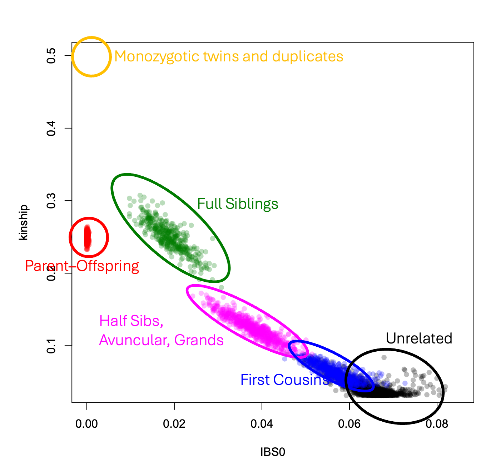

# QC Step 4. Relatedness

1. `SNPRelate::snpgdsOpen("Path")` : re-open the GDS file but using the other package than `GWASTools`
    -   >class(gdsobj) \
        >\[1\] "SNPGDSFileClass" "gds.class"   

2. Extract the SNP-ids (passed SNP-level filter: `missing.n2 < 0.05`) for inclusion for kinship calculation

3. 
    ```r
    SNPRelate::snpgdsIBDKING(gdsobj, #object of class SNPGDSFileClass, a SNP GDS file
    sample.id=NULL, snp.id=NULL, #INCLUSION
    remove.monosnp=TRUE, #(default) remove monomorphic SNPs
    num.thread=1L, ...)
    ```
    
    - **Goal**: Calculate kinship coefficient for each <u>pair of scans</u> in order to describe <mark>genetic relatedness</mark>
        - Φ = ¼ k₁ + ½ k₂Φ is the total proportion of alleles inferred to be shared IBD between the pair

    - **Method**: IBD analysis in `SNPRelate` package (KING method of moment)

    - **Output**: proportion of SNPs with zero IBS (IBS0) and <mark>symmetric n_sample x n_sample kinship coefficient matrix</mark> (`$kinship`)
        ```
        > ibdobj
        List of 5
        $ sample.id: int [1:77] 280 281 282 283 284 285 286 287 288 289 ...
        $ snp.id   : int [1:1926] 999512 999561 999567 999569 999577 999578 999580 999620 999633 999659 ...
        $ afreq    : NULL
        $ IBS0     : num [1:77, 1:77] 0 0 0 0 0.0556 ...
        $ kinship  : num [1:77, 1:77] 0.5 0.5 0.242 0.242 0.0133 ...
        - attr(*, "class")= chr "snpgdsIBDClass"
        ```
        
        - `snpgdsIBDSelection(ibdobj)` to find all pairs of samples with kinship coefficient
            ```
            ID1 ID2       IBS0       kinship
            1   280 281 0.00000000  0.5000000000
            2   280 282 0.00000000  0.2419928826
            3   280 283 0.00000000  0.2420071048
            ```

4. Finished using SNP GDS file -> close: `snpgdsClose(gdsobj)`

<br>

5. `GWASTools::pedigreeCheck()` will help us <u>look for errors in the pedigree</u> (i.e., the **reported** relationships, including duplicates, impossible relationships, and other inconsistencies) before comparing reported vs. genetic relatedness. 

    - 
        ```r
        # Get pedegree data & rename as required by `pedigreeCheck()`
        ped <- pData(scanAnnot)[, c("family", "subjectID", "father", "mother", "sex")]

        names(ped) <- c("family", "individ", "father", "mother", "sex")

        pedigreeCheck(ped)
        #$duplicates
        #$parent.no.individ.entry
        #$unknown.parent.rows
        ```

    5.1. Always first <mark>remove duplicates</mark> from the pedigree
    - `pedigreeDeleteDuplicates(ped, chk$duplicates)`: to make a new pedigree with the duplicates removed

    **<span style="color:gold; bold">
        [NOTE!!] RERUN `pedigreeCheck()` after fixing EACH issue
    </span>**

    5.2. Other/new issues
    - `$parent.no.individ.entry`: Individual has a parent whose ID doesn't occur as an "individ" in the pedigree
        ```
        $parent.no.individ.entry
        row.num family no_individ_entry  parentID
        1       8   1341           mother 200039107
        ```
        - <u>Solution</u>: making and adding on a new row for this mother

    - `$unknown.parent.rows`: the person in has one parent known and one missing
        ```r
        chk$unknown.parent.rows
        #   row.num family
        #1      42     58
        ```
        - <u>Solution</u>: makeup an ID for the missing one -> update that in row (child) with issue -> and add a new row to the pedigree for this missing parent

    - `$subfamilies.ident`: shows subfamilies (i.e., families where not everyone is linked into the same pedigree as constructed by fathers'/mothers' IDs)
        ```r
        ped.complete %>% filter(family==1341)
        #family   individ    father    mother sex
        #1    1341 200191449         0         0   F
        #3    1341 200030290 200099417 200191449   F
        #5    1341 200099417         0         0   M
        #12   1341 200122600         0         0   M
        #13   1341 200015835 200122600 200039107   M
        #11   1341 200039107         0         0   F
        ```
        - <u>Solution</u>: We should make these subfamilies into new families; 
            - *Pseudo-code*: get the individuals from subfamily 2 from each family and add on "-2" their family IDs


    - more upcoming...

<br>

---
So far, we have a <mark>clean pedigree</mark> => Can <u>***assign the pairwise expected relatedness***</u> for all the subjects in the completed pedigree 

---
<br>

6.  ```r 
    GWASTools::pedigreePairwiseRelatedness(
        complete.pedegree.object)
    ```
    - Goal: Assign the <mark>expected genetic relatedness</mark> for each pair of subjects, based on the **reported pedigree** structure.

    - **Output**: 
        - `$relativeprs`: cols--"Individ1", "Individ2", <mark>"relation"</mark>("U" = unrelated, "PO" = parent/offspring...), "kinship" (kinship coefficient), "family" (family id)

<br>

7. Plot of the IBD coefficient estimates, color-coded by the
expected relationships we've just calculated

    - Data Prep
        * Merge subjectID (from scanAnnot) for the ScanID-pairs to the ibdobj-created *ScanID-paired* kinship-coeff dataframe 
            ```r
              #ibdobj-created         #subjectIDs
              ID2 ID1 IBS0   kinship  Individ1  Individ2
            1 281 280    0 0.5000000 200191449 200191449
            2 282 280    0 0.2419929 200191449 200030290
            3 282 281    0 0.2415330 200191449 200030290
            ```
        
        * Create a pair-identifier variable to enable merging ibd with `$relativeprs` (i.e., merge the observed and expected genetic relationship data)
            ```r
            #example
            GWASTools::pasteSorted(ibd$Individ1, ibd$Individ2, sep="/") #"sorted" is important to prevent same pairs being diff
            ```

        * Merge the observed and expected genetic relationship data 
            * AND clean the ***expected-relatedness***/-relationship column (same individual pair -> "Dup", missing -> "U") to match the output of `ibdAssignRelatednessKing` (next step)

        * `ibdAssignRelatednessKing(ibs0 = ibd$IBS0, kc = ibd$kinship)`: call the ***observed-relationships*** based on IBS0 and kinship values for each pair (from KING model)
            - "Deg3"=any third degree, "U"=unrelated

    - Plot KC (Phi) vs IBS0 (k0)

        ```r
        # Draw horizontal thresholds for assigning relationships using kinship coefficients (taken from table 1 of Manichaikul (2010))

        cut.dup <- 1 / (2^(3/2))
        cut.deg1 <- 1 / (2^(5/2))
        cut.deg2 <- 1 / (2^(7/2))
        cut.deg3 <- 1 / (2^(9/2))

        cols <- c(Dup = "magenta",
                  PO = "cyan",
                  U = "black")

        plot(x = ibd$IBS0,
            y = ibd$kinship,
            col = cols[ibd$exp.rel],
            xlab = "Fraction of IBS=0 (k0)",
            ylab = "Kinship coefficient (Phi)"
        );abline(h = c(cut.deg1, cut.deg2, cut.deg3, cut.dup),
                lty = 2,
                col = "gray"
        );legend("topright",
                legend = names(cols),
                col = cols,
                pch = 1)
        ```
        

        <details>
        <summary>R code for interactively plot (ggplot + ggplotly) </summary>
        ```r
        library(plotly)
        ibd_plot = ibd %>% 
            ggplot(aes(x=IBS0, y=kinship, color=exp.rel)) +
                geom_point(shape = "o", size = 4, alpha=0.6,
                        #from plotly
                        aes(text = paste0("ind1/ind2: ",ii,"<br>",
                                            "IBS0: ",round(IBS0,4),"<br>",
                                            "kinship ",round(kinship,4),"<br>",
                                            "expected rel: ",exp.rel,"<br>",
                                            "observed rel: ",obs.rel,"<br>")) 
                        ) + 
                geom_hline(yintercept = c(cut.deg1, cut.deg2, cut.deg3, cut.dup), 
                            linetype = "dashed", 
                            color = "gray") + 
                scale_color_manual(name="Expected Relationship",
                                values = c("magenta","cyan","black")) +
                theme_classic() + theme(legend.position="top") + 
            #add annotation for the lines
            annotate("text", x = 0.12, y = c(cut.deg1, cut.deg2, cut.deg3, cut.dup),
                    label = c("cut.deg1", "cut.deg2", "cut.deg3", "cut.dup"),
                    color = "black", size = 4, vjust = -0.2)

        ggplotly(ibd_plot, tooltip = "text")
        ```
        </details>

    <br>

    - Make a table to summarize the results (expected vs observed relationship)
    
    - Get the family IDs of the unmatched pairs -> further check `scanAnnot` data
        - <span style="color:red">Remember</span>: when fixing the data (esp. parent-offspring relationship), fix both their `father`/`mother` & `family` columns

    - After fix, recalculate + replot + add a column to the `scanAnnot` to indicate changes

<br>

# QC Step 5. PCA 

1. Exclude SNPs from a few problematic loci: 2q21 (LCT), HLA, 8p23, and 17q21.31
    
    - **Rationale**: Those variants will result <u>PCs that are highly correlated with these SNPs</u>, which is undesirable!

    - **Solution**: `GWASTools` supplies the positions of these loci in the relevant genome build in a data frame called `pcaSnpFilters.hg18`
        ```r
        filt <- get(data(pcaSnpFilters.hg18))
        ```

2. Filter **Subjects**
    
    - Remove <u>duplicate scans</u> ([NOTE] for each subject with multiple samples, we want to <u>keep only the lowest missingness one</u> based on `missing.e1`)
   
    - One strategy is to take advantage of the feature of `duplicated()` function:
        ```r
        pData(scanAnnot_test) %>% 
            arrange(subjectID, missing.e1) %>% 
            mutate(duplicated=duplicated(subjectID)) %>% # only lowest missing.e1 were kept, i.e., FALSE for duplicated() (higher missing + duplicates were ranked later -> TRUE for duplicated())
            arrange(scanID) #reorder it back to the scanID ascending (same as the input sequence)
        ```

3. LD pruning
    ```r
    snpgdsLDpruning(gdsobj,    #SNPGDSFileClass, a SNP GDS file
                    sample.id, #selected samples
                    snp.id,    #selected SNPs
                    autosome.only=TRUE, remove.monosnp=TRUE, maf=0.05, missing.rate=0.05, method = "corr", #r
                    slide.max.bp = 10e6, #10Mb
                    ld.threshold = sqrt(0.1)) #r2<=0.1, indep.
    ```

4. Conduct PCA
    ```r
    pca <- snpgdsPCA(gdsobj, sample.id, snp.id = snp.pruned)
    ```

5. <mark>Visualization</mark>: 
    - Extract n*PCs ==> add a column for scanID as 'key' (`pca$sample.id`) ==> merge with `scanAnnot` 
    - Plot (colored by `race`) 
        1. pairwise PCA plot; 
        2. Parellel Coordinate Plot 

    <details>
    <summary>see R code for data prep and viz below</summary>
    
    ```r
    # extract the first 4 PCs
    df_pca_plot = pca$eigenvect[,c(1:4)] %>% as.data.frame()
    colnames(df_pca_plot) = c("PC1","PC2","PC3","PC4")
    # add key for merge
    df_pca_plot$scanID = pca$sample.id
    # merge with scanAnnot
    merged_pca_plot = 
        merge(x = pData(scanAnnot),
            y = df_pca_plot,
            by = "scanID",
            all.y = TRUE)
    dim(merged_pca_plot)

    # plot
    # library(GGally) #suggested by chat-gpt
    # ggpairs(merged_pca_plot, 
    #         columns = 21:24,  # Assuming PC1-PC4 are the first 4 columns
    #         aes(color = race),
    #         upper=NULL, diag=NULL)


    # df to store pc pairs
    tmp_pc_pairs = data.frame("pair1"=rep(NA,16), pair2=NA)
    row=1
    for (i in seq(1:4)){
        for (j in seq(1:4)){
            if (row <= 16){
                tmp_pc_pairs[row,"pair1"] = i
                tmp_pc_pairs[row,"pair2"] = j
            }
            row = row +1
        }
    }
    filtered_pc_pairs = tmp_pc_pairs %>% filter(pair1<pair2)
    filtered_pc_pairs$pair1 = paste0("PC", filtered_pc_pairs$pair1)
    filtered_pc_pairs$pair2 = paste0("PC", filtered_pc_pairs$pair2)
    print(filtered_pc_pairs) #ready for plotting

    # loop through the target and make a plot
    library(patchwork)
    {
        p = NULL #setup canvas
        for (i in seq(nrow(filtered_pc_pairs))){
            canvas = merged_pca_plot %>% 
                ggplot(aes(x=.data[[ filtered_pc_pairs[i,"pair1"] ]],
                        y=.data[[ filtered_pc_pairs[i,"pair2"] ]], 
                        color=race)) +
                geom_point(size=3) + 
                theme_bw() + 
                labs(title=paste0(filtered_pc_pairs[i,"pair2"]," vs ",filtered_pc_pairs[i,"pair1"]))
            
            # control patchwork
            if (is.null(p)){
                p = canvas
            } else {
                p = p+canvas
            }
        }
        p #plot
    }

    #### Parellele coord plot
    ggparcoord(data = merged_pca_plot,
            columns = 21:24, 
            groupColumn = "race",
            showPoints = TRUE) + 
        scale_color_brewer(palette = "Set2") + 
        theme_bw()
    #reference: https://r-charts.com/ranking/parallel-coordinates-ggplot2/

    ```
    </details>

<br>

# QC Step 6. Duplicate Sample Discordance to Assess *Probe Quality*

**Idea**: If the same probe/SNP often yields different genotypes for duplicate scans from the same subjects, we should probably exclude the genotypes called from that probe. 

1. **Exclude** low quality scans/samples (`scanAnnot$missing.e1 >= 0.05`) and SNPs (`snpAnnot$missing.n1 == 1`) ==> Calculate statistics

    ```r
    dupdisc <- duplicateDiscordance(
        genoData, #GenotypeData object (GWASTools)
        subjName.col = "subjectID",
        scan.exclude = scan.excl,
        snp.exclude = snp.excl
    )
    names(dupdisc)
    #[1] "discordance.by.snp"     "discordance.by.subject" "correlation.by.subject"
    ```

    - **Output**: 
        - `dupdisc$discordance.by.snp`: A row for each SNP with 5 columns

            1. `snpID`
            2. `discordant` (number of discordant pairs)
            3. `npair` (number of pairs examined)
            4. `n.disc.subj` (number of subjects with at least one discordance)
            5. `discord.rate` (discordance rate = `discordant`/`npair`)

        - `dupdisc$discordance.by.subject`: List of matrices for each subject **with** duplicate scans -> showing at what proportion of SNPs do two scans from the same person have different genotypes?

    - Merge `dupdisc$discordance.by.snp$discordant` back to `ScanAnnot` for downstream query

<br>

2. Depending on the <u>total number of <span style="color:red">pairs of duplicate samples</u>, you apply a <span style="color:red">different exclusion threshold</span> for SNP discordant pairs:

    |Duplicate pairs | Remove probe *if discordant genotype count* |
    |-               |-    |
    |30 ≤ n < 75	 | ≥ 1 |
    |75 ≤ n < 219	 | ≥ 2 |
    |219 ≤ n < 413	 | ≥ 3 |
    |413 ≤ n < 641	 | ≥ 4 |
    |641 ≤ n < 894	 | ≥ 5 |
    |894 ≤ n < 1167	 | ≥ 6 |
    
    >Model: We recommend a filter threshold of ≥ m discordant calls because this retains > 99% of SNPs with an error rate < 10⁻³, while removing > pbinom(m, 2*d, 0.01, lower.tail=F)% of SNPs with an error rate > 10⁻². This threshold eliminates x SNPs.
    >    - d is the number of duplicate pairs
    
    - e.g., in this case, we have *d=34* pairs of duplicate samples for most of the probes
        - then *m=1* (from the table)
        
        - Method1: `pbinom(q=1, size=2*34, prob=1e-2, lower.tail=FALSE)` = the cumulative probability of having ≥1 discordant pair among 2*34 trials with probability of 10e-2 = 0.1483238

        - Method2: 
            ```r
            duplicateDiscordanceProbability(npair=34, error.rate = c(1e-3, 1e-2))
            #dis>1 2.147291e-03 1.459858e-01
            ```

    - *Answer: We recommend a filter threshold of ≥1 discordant calls because this retains > 99% of SNPs with an error rate < 10⁻³, while removing >14.8% of SNPs with an error rate > 10⁻². This threshold eliminates x SNPs.*

3. (Optionally, histogram of the discordant rate:)
    ```r
    hist(dupdisc_MissingN2$discordance.by.snp$discord.rate,
        xlab="discordance rate", main="Histogram of discordance rate \nof the SNPs with missing.n2 < 0.05")`
    ```

<br>

# QC Step 7. Hardy-Weinberg Equilibrium (HWE) testing

**Idea**: Deviations from HWE can indicate poor genotyping

<span style="color:gold">**[NOTE 1]**</span> The test we'll use for HWE will <span style="color:gold">assume independent observations</soan>

- Therefore we should <span style="color:gold">include</span> only <u>one scan from each subject</u>

- We should also <span style="color:gold">include</span> <u>only "founders"</u>
    - The *nonfounders* are the individuals who have a mother or father in the pedigree

<span style="color:gold">**[NOTE 2]**</span> HWE is sensitive to <u>population stratification</u> (i.e., a SNP can be in HWE in each of two populations, but out of HWE in the combined population)

<br>

1. Exclude a) populations other than CEU, b) nonfounders, and c) duplicates -> creating a `scan.excl`

2. `exactHWE()` separate by Autosome & X Chr 
    - or will get the error message--"X chromosome must be analyzed separately"

    ```r
    chr <- getChromosome(genoData)
    auto <- range(which(chr %in% 1:22)) #range of index of SNPs
    X <- range(which(chr == 23))

    hwe <-
    exactHWE(
        genoData,
        scan.exclude = scan.excl,
        snpStart = auto[1],
        snpEnd = auto[2]
    )
    hweX <-
    exactHWE(
        genoData,
        scan.exclude = scan.excl,
        snpStart = X[1],
        snpEnd = X[2]
    )
    hwe <- rbind(hwe, hweX)
    ```

3. Inspect deviation from HWE using QQ plot
    
    - Exclude monomorphic & missing SNPs
    - `GWASTools::qqPlot()`

