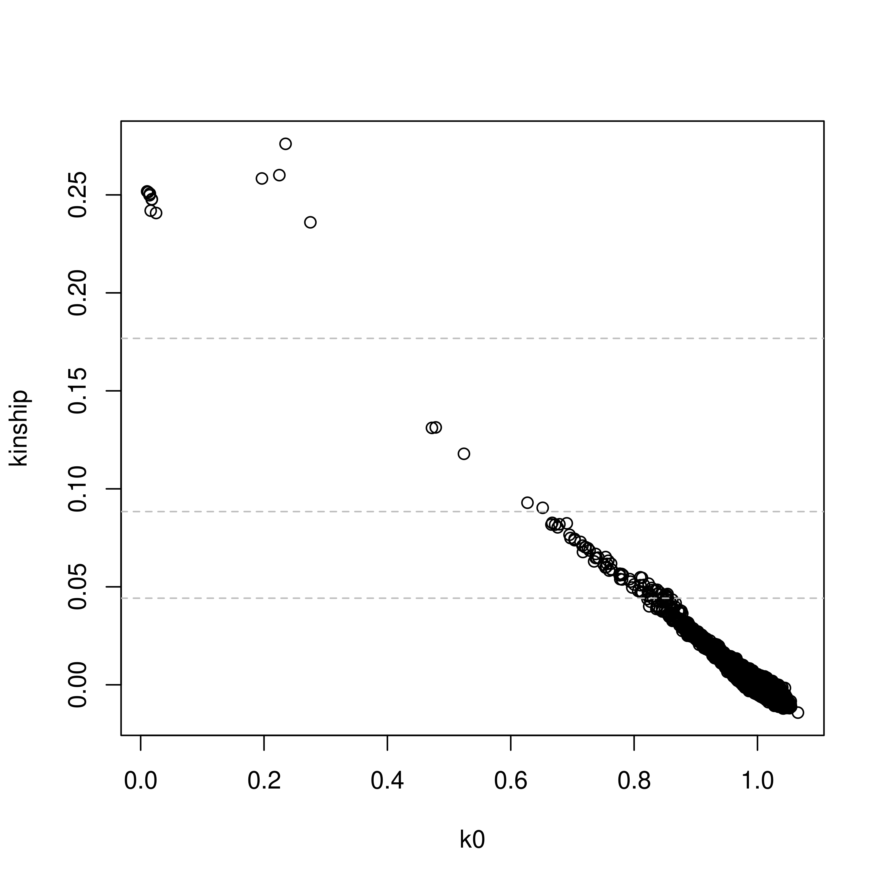
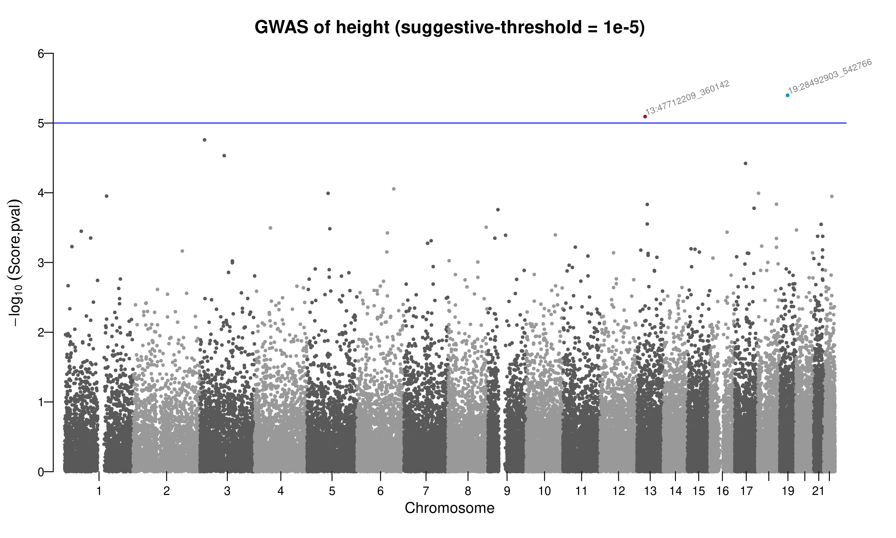
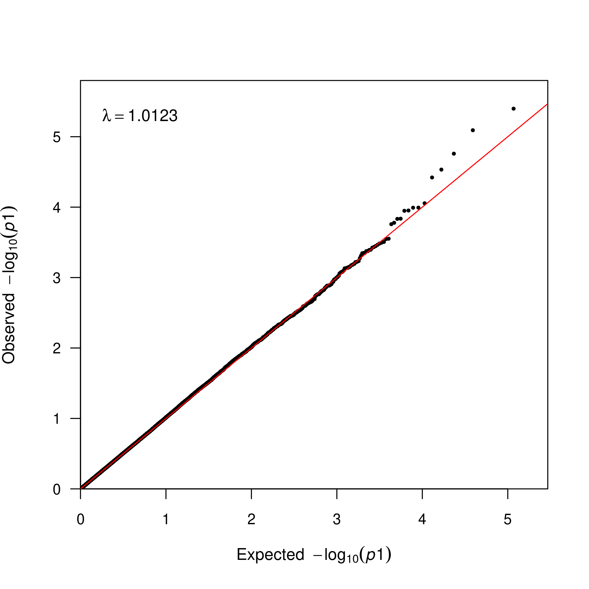

# Height GWAS

## 0. Data Description

### 0.1. Sample data

* N = 2548
* median heights: 
  * males > females
  * AFR > EAS > SAS > AMR > EUR
    ```
    pop median_heights
    AFR	173.7158			
    EAS	168.8816			
    SAS	168.6429			
    AMR	165.2727			
    EUR	161.2815
    ```
Based on the EDA, it is clear that `sex` and `pop` are associated with heights. They might also affect genetic info (especially population structure), so we should adjust for them in the GWAS. 

### 0.2. Genotype Data (Post-imputation)

* From TOPMed -> downsampled

* Variant info (`snp.info`) 
  * 647,629 variants in total
    * = 10,009 genotyped + 637,620 imputed variants 
    * 23,747 variants with ALT allele freq = 0 | 1

  * Determine the imputation R2 threshold (<mark>r2 > 0.3</mark> -> n=241,225)
    * Reason: We can see that the amount of low-quality imputed variants stop to drop at around **r2 = 0.3**, so this could be a reasonable threshold while retaining more reasonably high-quality variants.

  * Determine MAF threshold
    * MAF > 5% (alt <mark>af > 0.05 & af < 0.95</mark>) 

* Kept SNP list (<mark>n = 58,513 SNPS to be included in GWAS</mark>)
    ```r
    snps.keep <- snp.info %>% 
        filter( (r2 > 0.3) 
              & (af > 0.05 & af < 0.95) ) %>% pull(snp.id)

    length(snps.keep) #58513 SNPS
    ```


## 1. PCA

* From the PC scree plot, the final largest drop is at PC4 -> PC5, which informs the <mark>selection of the first 5 PCs</mark>.

* However, from pairwise PC plot (first 8 PCs), we can see that first 4 PCs are clearly explaining cross-ancestry variances, while PC5, 6, 8 are explaining variances within the AFR population and PC7 is explaining that within the EAS population. It is noteworthy that PC6 vs PC8 seems separating AFR population into 7 subpopulations. Thus, it seems reasonable to include the first 8 PCs.
    * stored in `p03-GWAS/PCs_20250313.pdf`

* Further from the Parellel Coordinate Plot, we can see that PC9 is further separating EUR population from others, and PC10 seems another PC explaining AFR sub population structure. There is no interesting things happen after PC10. 

<mark>Thus, we decided to include the first 10 PCs</mark>


## 2. Kinship (`PC-Relate`)

Kinship Plot (top line is `cut.deg1` (NOT dup!))



Interpretation: **we should account for relatedness using GRM as random effects** because it is clear from the kinship plot that we have majority of unrelated and 3rd degree, but we also have data clouds of parent offspring (kinship=0.25, k0=0), full-siblings (kinship=0.25, k0=0.25), and a few 2nd degree relatives. 

<br>

## 3. Null Model

$$
\text{height}_{ij} \sim \beta_0 + \beta_1 \text{sex}_{ij} + X_{\text{first 10 PCs}} \gamma + Wu_{j} + \epsilon_{ij}
$$

* `sex`, population structure (first 10 PCs), random effects/intercept (GRM)

```r

nullMod_lmer = fitNullModel(x = sample.info.pcs,
                            outcome = "height",
                            covars = c("sex", paste0("PC",1:10)), 
                            cov.mat = GRM, # varCov structure of LMM (A, GRM)
                            family = "gaussian", # LMM
                            sample.id = NULL, # IDs for samples to include (all)
                            two.stage = FALSE) # NO rank-baed INT of residuals

```

## 4. Two-step Adjustment Association Test

```r
# read in GDS file
gdsfile <- paste0(my_folder, "p3_imputed_data.gds")

# create genotype data object
geno <- GdsGenotypeReader(filename = gdsfile)
genoData <- GenotypeData(geno)
genoData

# create the genotype block iterator
iterator <- GenotypeBlockIterator(genoData, snpBlock=5000, snpInclude=snps.keep)
# length(snps.keep) #MAF & R2 threshold

# run association test 
#  REPLACE your_null_model WITH YOUR NULL MODEL OBJECT FROM PART 3
assoc <- assocTestSingle(iterator, 
                         null.model = nullMod_lmer,
                         geno.coding = "additive",
                         BPPARAM=BiocParallel::SerialParam())

head(assoc)
# freq: effect allele freq
# Est : beta approximation
# PVE : single-var SNP-based heritability approximation
```


## GWAS Report

The QQ plot and the manhattan plot for GWAS were plotted. $\lambda_{GC}$ is calculated to be 1.01232, which is below 1.1 meaning that there is no significant genomic inflation. 

There is **no genome-wide significant locus** from this study (should be very underpowered for the phenotype height). 

"19:28492903" is the most signficant variant associated with height. The effect size approximation (Est/beta approx) is -0.885, meaning that for 1 additional copy of the effect allele, height of the sample would be decrease by -0.885 unit. Its single-variant SNP-based heritability approximation is 0.00838359 (0.84%).

This is an underpowered study (for phenotype like height), while we obtained a SNP-based heritability (h2_g) of 22.67%.

```r
varCompCI(null.model = nullMod_lmer, prop = TRUE)
# V_A = 0.2267407 (= 22.67%)
```



