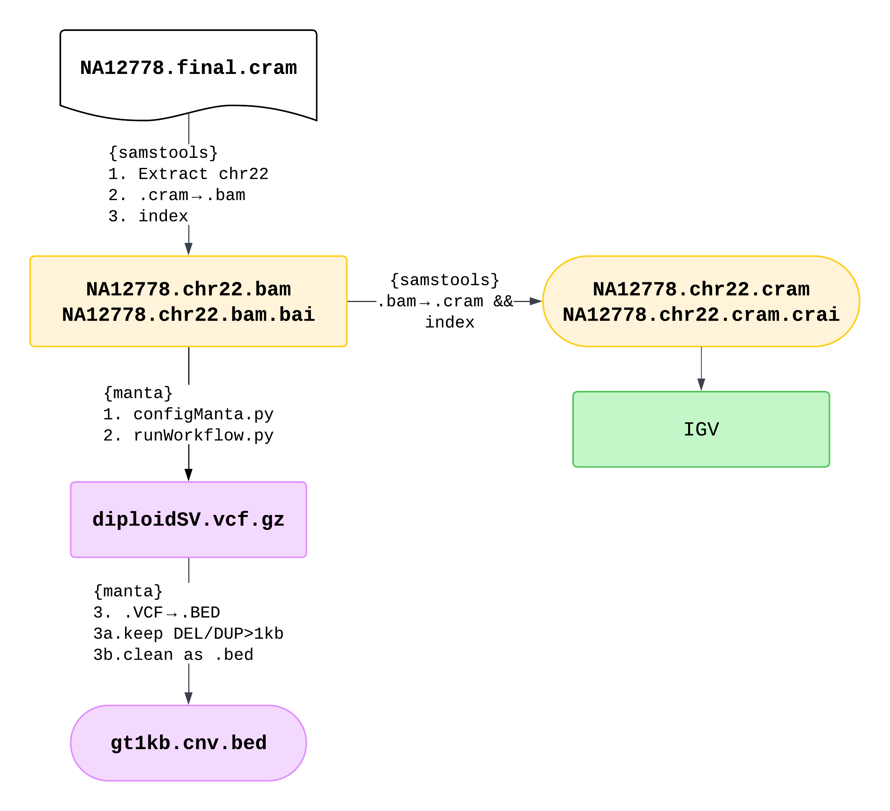

# Project 06: Structual Variant Calling Pipeline Report

__Author__: Tianze (Vincent) Luo <br>
__Date__  : 2025-04-21 <br>

__Table of Contents__
- [Project 06: Structual Variant Calling Pipeline Report](#project-06-structual-variant-calling-pipeline-report)
  - [0. Background](#0-background)
  - [Part I. SV Calling](#part-i-sv-calling)
    - [1. Extract chr22 alignments (`.BAM`) \&\& index](#1-extract-chr22-alignments-bam--index)
    - [2. Manta caller (used single tool in this pipeline)](#2-manta-caller-used-single-tool-in-this-pipeline)
    - [3. Convert chr22 alignments `.bam` to indexed `.cram`](#3-convert-chr22-alignments-bam-to-indexed-cram)
    - [4. Part I Summary](#4-part-i-summary)
      - [Summary of the SVs called](#summary-of-the-svs-called)
  - [Part II. Investigate with IGV](#part-ii-investigate-with-igv)


<br>

## 0. Background

- Interactive session command: `crc-interactive --teach -a hugen2072-2025s  -t 4:00:00`

<br>

- Start `.cram` file: `p6/NA12778.final.cram`
  
  - Alternative format for `.bam`
  
  - __NA12778__: Female resident of Utah with Northern and Western European–associated ancestry [1000 Genome Project]

- Reference sequence: `p6/GRCh38_full_analysis_set_plus_decoy_hla.fa`

<br>

## Part I. SV Calling

### 1. Extract chr22 alignments (`.BAM`) && index

Will call SVs on chromosome 22 only


### 2. Manta caller (used single tool in this pipeline)

manta SV discovery caller based on __discordant pairs (PE)__ and __split reads (SR)__.

`manta` workflow:
- `configManta.py`
- `manta_test/runWorkflow.py`
- variant `.VCF` -> `.BED`
  - Extract <mark>DEL/DUP > 1 kb<mark> (`.bed`)


### 3. Convert chr22 alignments `.bam` to indexed `.cram`


### 4. Part I Summary




#### Summary of the SVs called

We have called __17 SVs in chr22__, more specifically DEL/DUP (CNVs) >1kb. 

- 16 of them are DELs and 1 of them is DUP:TANDEM

_The table below is generated from results of `luo_script_SV-summary.R`_

| sv_type    | count | avg_length |
| :--------- | :---- | :--------- |
| DEL        | 16    | 18638      |
| DUP:TANDEM | 1     | 58303      |
| ALL        | 17    | 20971      |

```sh
wc -l gt1kb.cnv.bed 
# 17 gt1kb.cnv.bed

cut -f4 gt1kb.cnv.bed | sort | uniq -c
#     16 <DEL>
#      1 <DUP:TANDEM>

## Summary
module load gcc/12.2.0 r/4.4.0
Rscript --vanilla luo_script_SV-summary.R
```


<br>
<hr>

## Part II. Investigate with IGV


<br>

1. one SV on _q arm_: `chr22   25054080        25056685        <DEL>` 
   
   

   - intron of KIAA1671

   - As shown in the summary table above (summarized from Dr. Brand’s slide), the evidences to call this SV as a __DEL__ include:
     1. Red paired reads: TLEN > insert size.
     2. Soft-clips within breakpoints: meaning that those bases mapped to the other end/pair.
     3. The coverage within breakpoints is ~50% lower.

<br>

2. one SV on _p arm_: `chr22   10781349        10783722        <DEL>`
   
   

   - intergenic region

   - __Seems more complicated than simply DEL__. The only evidences to call it as a DEL (by `manta`) is the 2x red paired reads (meaning TLEN > insert size). <mark>I am less confident in this call because:</mark>
     1. The signals are noisy at this region (a lot of softclips)
     2. Minial decrease in coverage --> not likely DEL

