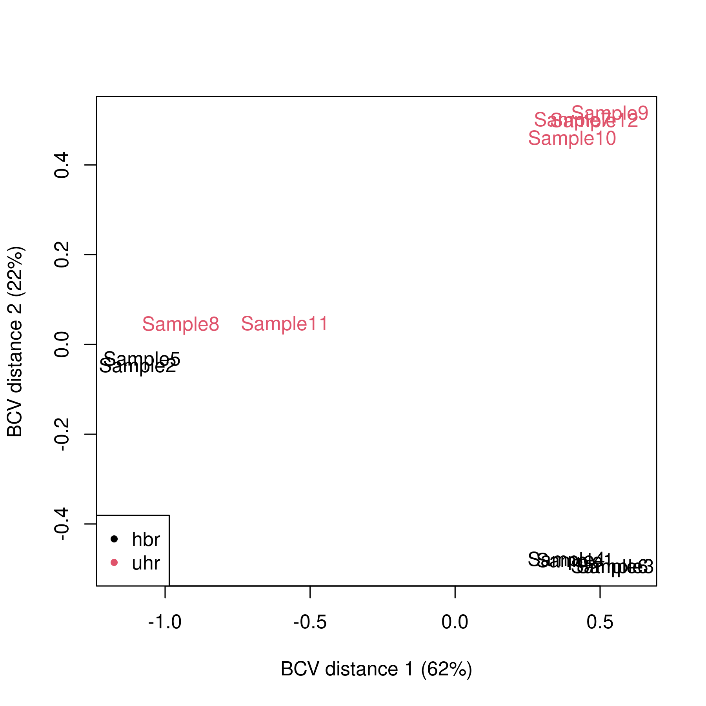
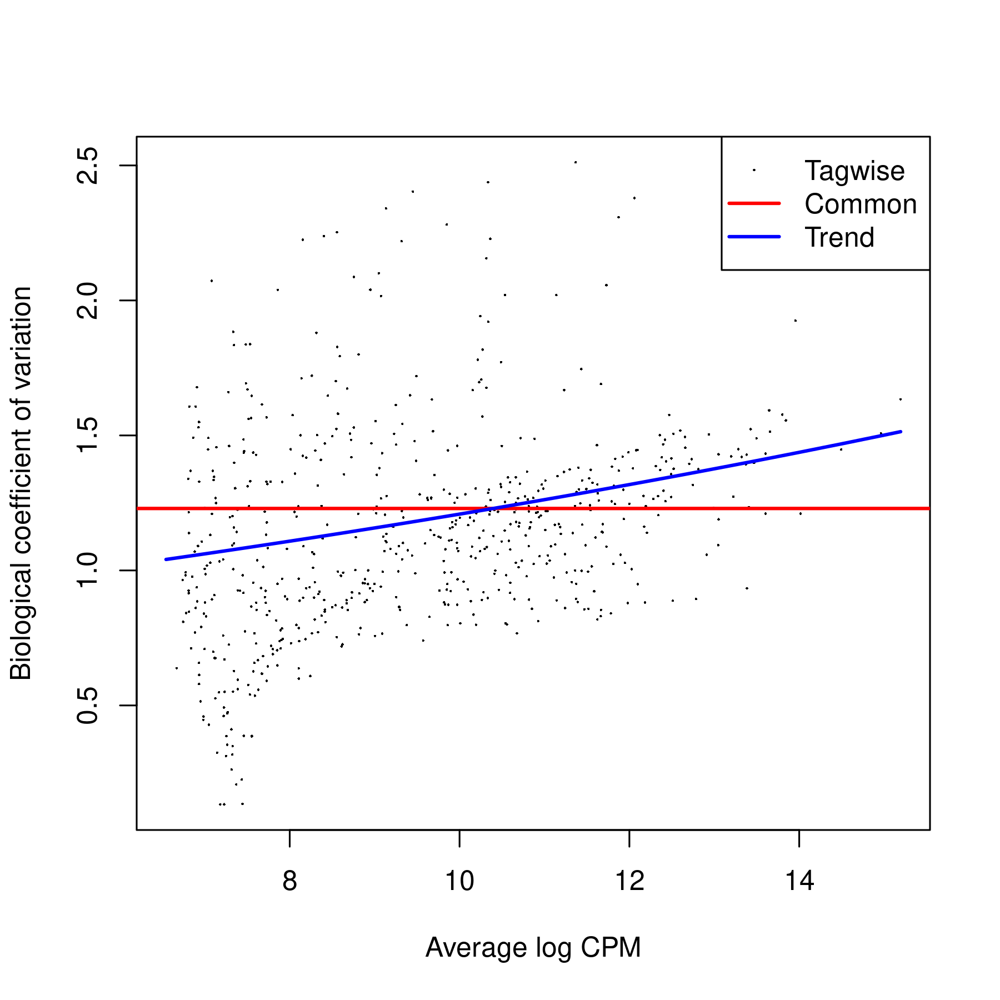
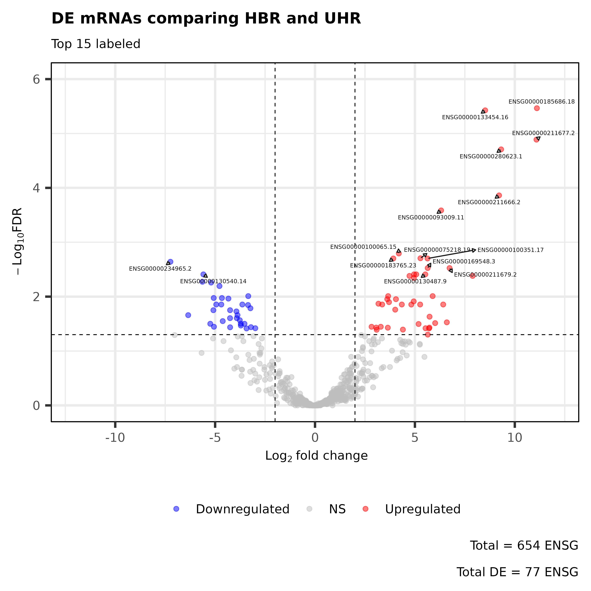

# Project 07 - RNA-seq for DE

__Author__: Tianze (Vincent) Luo \
__Date__: 2025-04-24


## Background

* RNA-seq data on a single chromosome in multiple experiments

* Files: `/ix1/hugen2072-2025s/p7/`

* Interactive session command: `crc-interactive --teach -a hugen2072-2025s -t 4:00:00`

<br>

<!-- # Pipeline - RNA-seq Alignment & DE -->

## 0. Setup JobArray Based on Experiments

<!-- ::: columns

:::: column -->

```sh
######## 0. Setup ArrayJobs ########
exp=$(awk -v lineNumb=$(($SLURM_ARRAY_TASK_ID+1)) 'NR==lineNumb { print $0 }' ls_exp.txt)

## for output file names
exp_prefix=$(echo $exp | sed 's/_ERCC.*//')

## add read{1,2} as input
#       .read1.fastq.gz
#       .read2.fastq.gz
exp_read1="${exp}.read1.fastq.gz"
exp_read2="${exp}.read2.fastq.gz"


echo "Job for Experiment *** ${exp_prefix} *** started at: $(date)"

echo $exp_read1

echo $exp_read2

```

<!-- ::::

:::: column  -->

> ls_exp.txt file
> HBR_Rep1_ERCC-Mix2_Build37-ErccTranscripts-chr22
> HBR_Rep2_ERCC-Mix2_Build37-ErccTranscripts-chr22
> UHR_Rep1_ERCC-Mix1_Build37-ErccTranscripts-chr22
> UHR_Rep2_ERCC-Mix1_Build37-ErccTranscripts-chr22

```sh
exp=$(awk -v lineNumb=$(($SLURM_ARRAY_TASK_ID+1)) 'NR==lineNumb { print $0 }' ls_exp.txt)
# $SLURM_ARRAY_TASK_ID = 0 --> line 1
# $SLURM_ARRAY_TASK_ID = 1 --> line 2
# $SLURM_ARRAY_TASK_ID = 2 --> ...
# $SLURM_ARRAY_TASK_ID = 3 --> ...

# Allows correspondance of jobarray ID to experiments

echo "Job for Experiment *** ${exp_prefix} *** started at: $(date)"
# Job for Experiment *** HBR_Rep1 *** started at: Thu Apr 24 23:01:35 EDT 2025

echo $exp_read1
# HBR_Rep1_ERCC-Mix2_Build37-ErccTranscripts-chr22.read1.fastq.gz

echo $exp_read2
# HBR_Rep1_ERCC-Mix2_Build37-ErccTranscripts-chr22.read2.fastq.gz
```

<!-- ::::

::: -->


## 1. `cutadapt`: trim adapter sequence

```sh
mkdir -p ../output/1_cutadapt

# -a/-A: Universal Illumina adapters (3')
# -o/-p: OUTPUT (first/second)
cutadapt -a AGATCGGAAGAGCACACGTCTGAACTCCAGTCA -A AGATCGGAAGAGCGTCGTGTAGGGAAAGAGTGT \
         -o ../output/1_cutadapt/${exp_prefix}.trimmed.R1.fastq.gz -p ../output/1_cutadapt/${exp_prefix}.trimmed.R2.fastq.gz \
         ../p7/${exp_read1} ../p7/${exp_read2}
         
         # Example
         # input: ../p7/HBR_Rep1_ERCC-Mix2_Build37-ErccTranscripts-chr22.read{1,2}.fastq.gz

         # output: -o ../output/1_cutadapt/HBR_Rep1.trimmed.R1.fastq.gz
```

<br>

## 2. `STAR`: Aligning the reads 

```sh
mkdir -p ../output/2_STAR

STAR --runThreadN 2 \ 
    --runMode alignReads \              # map reads
    --outSAMstrandField intronMotif \   # strand derived from the intron motif. reads with inconsistent and/or non-canonical introns are filtered out.
    --twopassMode Basic \ 
    --readFilesIn ../output/1_cutadapt/${exp_prefix}.trimmed.R1.fastq.gz \ 
                  ../output/1_cutadapt/${exp_prefix}.trimmed.R2.fastq.gz \ 
    --outFileNamePrefix ../output/2_STAR/${exp_prefix} \    # ../output/2_STAR/HBR_Rep1
    --quantMode GeneCounts \    # only count matrix; No output SAM/BAM alignments
    --outStd Log \              # which output will be directed to stdout (standard out) -- only log
    --outWigType bedGraph \ 
    --outWigReferencesPrefix ../output/2_STAR/${exp_prefix}_bedgraph \ 
    --genomeDir ../p7/STAR_reference/ \  # where genome indices where generated (pre-generated)
    --readFilesCommand zcat \   # zcat - to uncompress .gz files
    --outSAMtype BAM SortedByCoordinate  # similar to samtools sort command.
```

<!-- ## 2. `STAR`: Aligning the reads (cont.) -->

- Perform downstream analysis using `*ReadsPerGene.out.tab`

```sh
[til177@teach-cpu-n0 2_STAR]$ ll *ReadsPerGene.out.tab
# -rw-r--r-- 1 til177 mmarazita 1.5M Apr 24 23:08 HBR_Rep1ReadsPerGene.out.tab
# -rw-r--r-- 1 til177 mmarazita 1.5M Apr 24 23:08 HBR_Rep2ReadsPerGene.out.tab
# -rw-r--r-- 1 til177 mmarazita 1.5M Apr 24 23:08 UHR_Rep1ReadsPerGene.out.tab
# -rw-r--r-- 1 til177 mmarazita 1.5M Apr 24 23:08 UHR_Rep2ReadsPerGene.out.tab
```

<br>

## 3. DGE analysis in R

```sh
module load gcc/12.2.0 r/4.4.0
Rscript --vanilla p07_DE_tvl.R > ../output/DiffGeneExpr.log
```

Important Notes in the DGE analysis pipeline

<span style="font-size:0.8em">

1. When we read `*ReadsPerGene.out.tab` into R, each file has 3 samples

    ```R
    > head(hbr1)
    #                  V1 V2 V3 V4
    # 1 ENSG00000223972.5  0  0  0
    # 2 ENSG00000227232.5  0  0  0
    # 3 ENSG00000278267.1  0  0  0
    # 4 ENSG00000243485.5  0  0  0
    # 5 ENSG00000284332.1  0  0  0
    # 6 ENSG00000237613.2  0  0  0
    > head(hbr2)
    #                  V1 V2 V3 V4
    # 1 ENSG00000223972.5  0  0  0
    # 2 ENSG00000227232.5  0  0  0
    # 3 ENSG00000278267.1  0  0  0
    # 4 ENSG00000243485.5  0  0  0
    # 5 ENSG00000284332.1  0  0  0
    # 6 ENSG00000237613.2  0  0  0
    # ...
    ```

    - The first column has the gene/transcript name
    - Columns 2-4 of each data frame contain the expression levels
    - __There are 6 HBR samples (stored in hbr1 and hbr2) & 6 UHR samples (stored in uhr1 and uhr2)__
    - Each has the same number of rows (60,710 transcripts)

2. Combine the count data into one data.frame (same transcript for each row across experiments) -> matrix

    ```R
    ## hbr first, uhr next
    expr <- cbind(hbr1[,c(2:4)], 
                hbr2[,c(2:4)],
                uhr1[,c(2:4)],
                uhr2[,c(2:4)])
    expr <- as.matrix(expr)
    class(expr)
    # [1] "matrix" "array" 
    rownames(expr) <- hbr1$V1
    colnames(expr) <- NULL

    dim(expr)
    # [1] 60710    12
    > head(expr)
    #                   [,1] [,2] [,3] [,4] [,5] [,6] [,7] [,8] [,9] [,10] [,11]
    # ENSG00000223972.5    0    0    0    0    0    0    0    0    0     0     0
    # ENSG00000227232.5    0    0    0    0    0    0    0    0    0     0     0
    # ENSG00000278267.1    0    0    0    0    0    0    0    0    0     0     0
    # ENSG00000243485.5    0    0    0    0    0    0    0    0    0     0     0
    # ENSG00000284332.1    0    0    0    0    0    0    0    0    0     0     0
    # ENSG00000237613.2    0    0    0    0    0    0    0    0    0     0     0
    #                   [,12]
    # ENSG00000223972.5     0
    # ENSG00000227232.5     0
    # ENSG00000278267.1     0
    # ENSG00000243485.5     0
    # ENSG00000284332.1     0
    # ENSG00000237613.2     0
    ```

</span>

<!-- ## 3. Important Notes in the DGE analysis pipeline (cont.) -->

<span style="font-size:0.8em">

3. Record the group info (required when doing DE analysis), create `DGEList` object (for normalizations & input into DE analysis)

    ```R
    # The first 6 were from HBR, the second 6 from UHR
    data_groups <- c(rep("hbr",6), rep("uhr",6))
    data_groups
    #  [1] "hbr" "hbr" "hbr" "hbr" "hbr" "hbr" "uhr" "uhr" "uhr" "uhr" "uhr" "uhr"

    d <- DGEList(counts=expr, group=factor(data_groups))
    d
    # An object of class "DGEList"
    # $counts
    #                   Sample1 Sample2 Sample3 Sample4 Sample5 Sample6 Sample7
    # ENSG00000223972.5       0       0       0       0       0       0       0
    # ENSG00000227232.5       0       0       0       0       0       0       0
    # ENSG00000278267.1       0       0       0       0       0       0       0
    # ENSG00000243485.5       0       0       0       0       0       0       0
    # ENSG00000284332.1       0       0       0       0       0       0       0
    #                   Sample8 Sample9 Sample10 Sample11 Sample12
    # ENSG00000223972.5       0       0        0        0        0
    # ENSG00000227232.5       0       0        0        0        0
    # ENSG00000278267.1       0       0        0        0        0
    # ENSG00000243485.5       0       0        0        0        0
    # ENSG00000284332.1       0       0        0        0        0
    # 60705 more rows ...

    # $samples
    #         group lib.size norm.factors
    # Sample1   hbr    37357            1
    # Sample2   hbr     3275            1
    # Sample3   hbr    38242            1
    # Sample4   hbr    45971            1
    # Sample5   hbr     4047            1
    # 7 more rows ...
    ```

4. Filter the data (filter OUT low-expressed transcripts across samples)

    ```R
    # cpm transformation -> T/F matrix -> rowSums (per transcript across samples)
    keep <- rowSums(cpm(d)>100) >= 2    # This picks out row numbers of genes that are expressed (cpm > 100) in at least 2 samples
    d <- d[keep,]                       # **Keep only the genes expressed (cpm > 100) in at least 2 samples**
    dim(d) # 654 genes are left
    # [1] 654  12

    d$samples$lib.size <- colSums(d$counts) # Update the "library size" (the total number of transcripts) for each sample
    d$samples
    #          group lib.size norm.factors
    # Sample1    hbr    37234            1
    # Sample2    hbr     3262            1
    # Sample3    hbr    38123            1
    # Sample4    hbr    45780            1
    # Sample5    hbr     4021            1
    # Sample6    hbr    46862            1
    # Sample7    uhr    63518            1
    # Sample8    uhr     4339            1
    # Sample9    uhr    64908            1
    # Sample10   uhr    41848            1
    # Sample11   uhr     3472            1
    # Sample12   uhr    42082            1
    ```

</span>

<!-- ## 3. Important Notes in the DGE analysis pipeline (cont.) -->

<span style="font-size:0.8em">

5. Normalize the reads and plot them

    ```R
    d <- calcNormFactors(d) # This stores the scaling factors for normalization in d$samples$norm.factors
    d
    # An object of class "DGEList"
    # $counts
    #                    Sample1 Sample2 Sample3 Sample4 Sample5 Sample6 Sample7
    # ENSG00000198062.15       0       0       0       0       0       0       3
    # ENSG00000206195.11       3       0       3       1       0       1     107
    # ENSG00000271127.2        0       0       0       0       0       0      11
    # ENSG00000232775.6        0       0       0       1       1       0       2
    # ENSG00000272872.1        1       0       1       1       0       1      22
    #                    Sample8 Sample9 Sample10 Sample11 Sample12
    # ENSG00000198062.15       0       3        5        1        4
    # ENSG00000206195.11       0     107       72        1       71
    # ENSG00000271127.2        0      11        1        0        1
    # ENSG00000232775.6        2       0        5        5        0
    # ENSG00000272872.1        0      22       12        0       12
    # 649 more rows ...

    # $samples
    #         group lib.size norm.factors
    # Sample1   hbr    37234    0.7271597
    # Sample2   hbr     3262    2.4586720
    # Sample3   hbr    38123    0.7191907
    # Sample4   hbr    45780    0.7275449
    # Sample5   hbr     4021    2.2131558
    # 7 more rows ...

    plotMDS(d, method="bcv", col=as.numeric(d$samples$group))
    legend("bottomleft", as.character(unique(d$samples$group)), col=1:2, pch=20)
    ```

6. Fit a trend in CV vs. mean (single dispersion & GLM)

    ```R
    d1 <- estimateCommonDisp(d, verbose=T)
    # Disp = 1.44585 , BCV = 1.2024 
    d1 <- estimateTagwiseDisp(d1)
    plotBCV(d1)

    # Estimate and plot again, using a generalize linear model to get better fit
    design.mat <- model.matrix(~ 0 + d$samples$group)
    colnames(design.mat) <- levels(d$samples$group)
    d2 <- estimateGLMCommonDisp(d,design.mat)
    d2 <- estimateGLMTrendedDisp(d2,design.mat, method="power")
    d2 <- estimateGLMTagwiseDisp(d2,design.mat)
    plotBCV(d2)
    ```

</span>

<!-- ## 3. Important Notes in the DGE analysis pipeline (cont.) -->

<!-- ::: columns

:::: column -->



<!-- ::::

:::: column -->



<!-- ::::

::: -->


<!-- ## 3. Important Notes in the DGE analysis pipeline (cont.) -->

<span style="font-size:0.8em">

7. DE analysis __between the HBR and UHR groups__

    ```R
    # compare groups 1 and 2 (HBR, UHR)
    et12 <- exactTest(d1, pair=c(1,2)) 

    # Look at the top 10 DE genes
    topTags(et12, n=10)
    # Comparison of groups:  uhr-hbr 
    #                        logFC    logCPM       PValue          FDR
    # ENSG00000185686.18 11.105786 12.402565 5.243387e-09 3.429175e-06
    # ENSG00000133454.16  8.517490  9.904674 1.146932e-08 3.750466e-06
    # ENSG00000211677.2  11.084370 12.382343 5.950079e-08 1.297117e-05
    # ENSG00000280623.1   9.316181 10.666070 1.198342e-07 1.959289e-05
    # ENSG00000211666.2   9.212263 10.571262 1.051225e-06 1.375002e-04
    # ...

    # How many are up- or down-regulated?
    de1 <- decideTestsDGE(et12, adjust.method="BH", p.value=0.05)
    summary(de1) 
    #        uhr-hbr
    # Down        32
    # NotSig     577
    # Up          45


    #### Plot log(fold change) vs. log(cpm) ####
    #   Significantly differently-expressed genes are shown in red
    de1tags12 <- rownames(d1)[as.logical(de1)]
    plotSmear(et12, de.tags=de1tags12)
    abline(h = c(-2, 2), col = "blue")


    #### Report the list of the differentially expressed genes (DEGs) ####
    # Get the summary table for: ***ALL DE genes with FDR < 0.05***
    DEG_fdr_tab = topTags(et12, n = Inf, adjust.method = "BH", p.value = 0.05) #adjusted p-value cutoff

    # 77 DEGs
    nrow(DEG_fdr_tab)
    # [1] 77
    # 32 down + 45 up
    summary(de1)
    #        uhr-hbr
    # Down        32
    # NotSig     577
    # Up          45

    #### Output ####
    library(tidyverse)
    df_DEG_fdr_tab = rownames_to_column(as.data.frame(DEG_fdr_tab), var = "ENSG")

    # 1. summary table
    write_csv(df_DEG_fdr_tab, file="../output/3_DiffGeneExpr_result/table_DEGs_fdr.csv")
    # 2. list of DEGs
    write.table( rownames(DEG_fdr_tab), file="../output/3_DiffGeneExpr_result/ls_DEGs_fdr.txt",
                quote = FALSE, sep=" ", row.names = FALSE, col.names = FALSE)

    ```

</span>

<!-- ## 3. Important Notes in the DGE analysis pipeline (cont.) -->

<!-- ::: columns

:::: column  -->


<!-- ::::

:::: column  -->



<!-- ::::

::: -->

- see `output/DiffGeneExpr.log` and `code/Rplots.pdf` for details.


