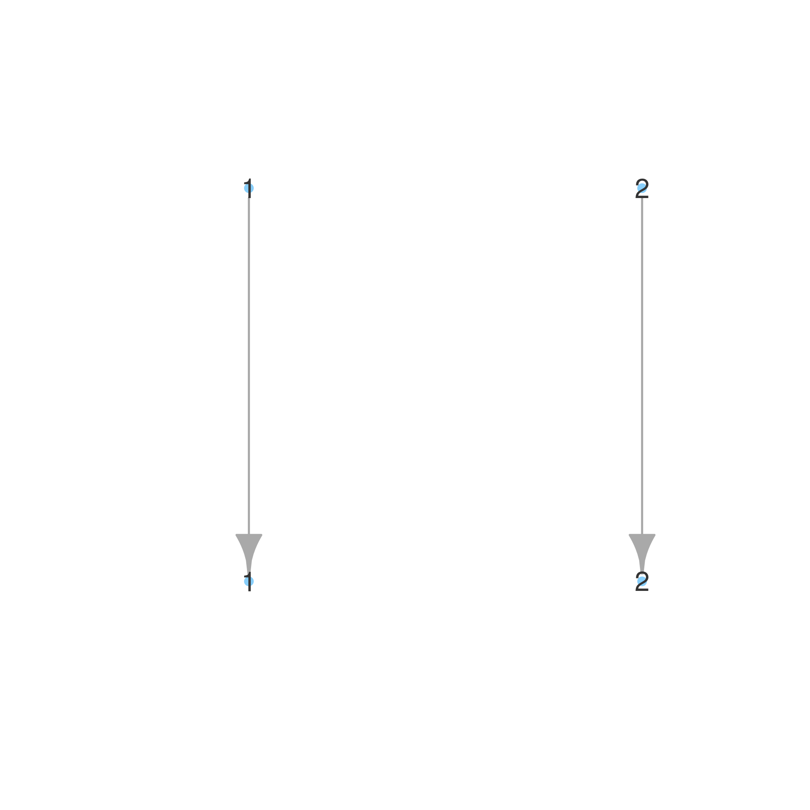
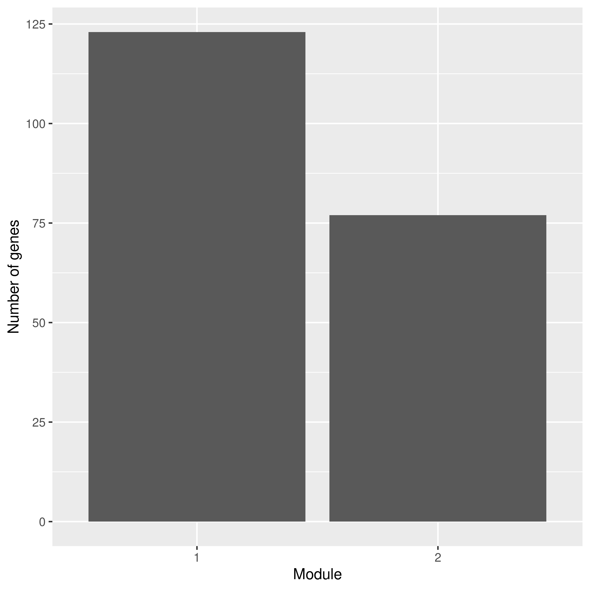
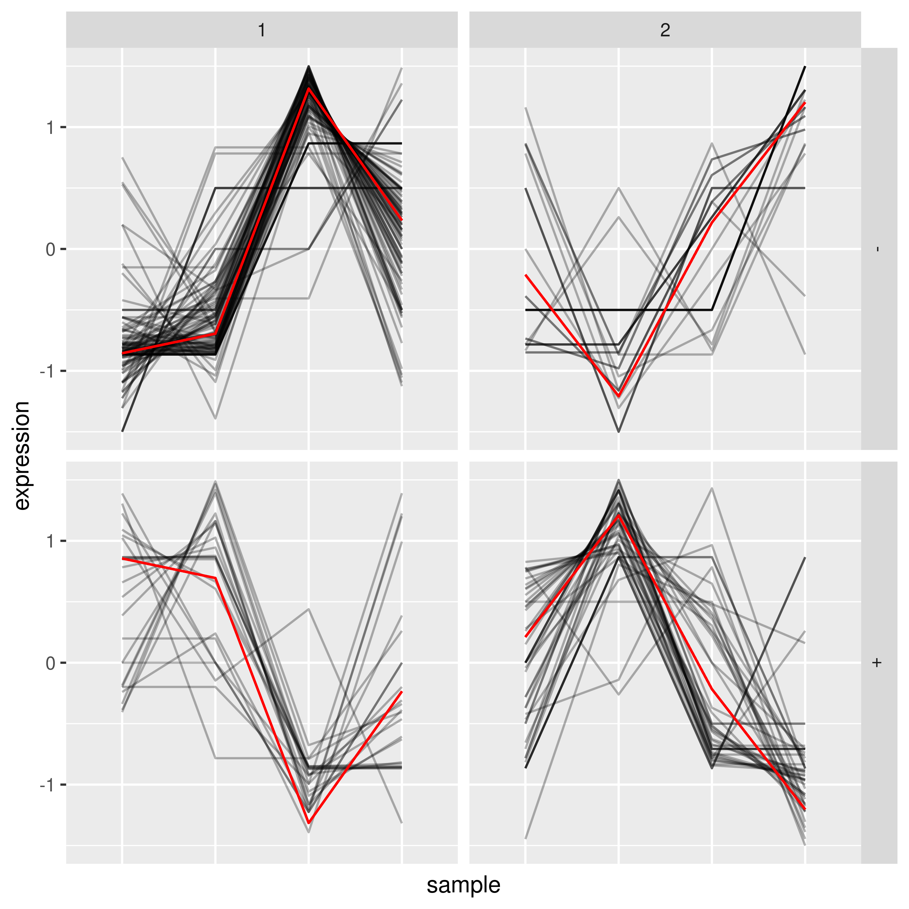

## 0. Preparation

- Interactive session: `crc-interactive --teach -a hugen2072-2025s -t 4:00:00`

- Data: 
    - Metadata: 
        ```
        Slide	Array	Exp	Condition
        UHR_Rep1	1	1_1	UHR
        UHR_Rep2	2	1_2	UHR
        BHR_Rep1	3	2_1	BHR
        BHR_Rep2	4	2_2	BHR
        ```
    - head of Expression matrix:
        ```
                        ,  UHR_Rep1, UHR_Rep2,   BHR_Rep1,   BHR_Rep2
        ENSG00000223972.5,  0,        0,          0,          0
        ENSG00000227232.5,  0,        0,          0,          0
        ENSG00000278267.1,  0,        0,          0,          0
        ENSG00000243485.5,  0,        0,          0,          0
        ENSG00000284332.1,  0,        0,          0,          0
        ```

- Install `GWENA` in R
    
    -   ```sh
        module load gcc/12.2.0 r/4.4.0
        R
        > BiocManager::install("GWENA")
        ```

<br>

# Reports

## Q1

Explain how the next line deals with the format difference from the example file. 
- Hint 1: what is the purpose of function t that is added to the example file. 
- Hint 2: you can try the next line without function t to see the difference.

```r
#### With transpose ####
UHRBHR_expr = t(read.table("./UHRBHRExpressions.csv", sep=',', header=TRUE, row.names=1))
dim(UHRBHR_expr)
# [1]     4 60710
UHRBHR_expr[1:4,1:4]
#          ENSG00000223972.5 ENSG00000227232.5 ENSG00000278267.1 ENSG00000243485.5
# UHR_Rep1                 0                 0                 0                 0
# UHR_Rep2                 0                 0                 0                 0
# BHR_Rep1                 0                 0                 0                 0
# BHR_Rep2                 0                 0                 0                 0
is_data_expr(UHRBHR_expr)
# $bool
# [1] TRUE

# $reason
# NULL

#### WITHOUT transpose ####
test_expr_mat = read.table("./UHRBHRExpressions.csv", sep=',', header=TRUE, row.names=1)
head(test_expr_mat, 4) # gene by sample
#                   UHR_Rep1 UHR_Rep2 BHR_Rep1 BHR_Rep2
# ENSG00000223972.5        0        0        0        0
# ENSG00000227232.5        0        0        0        0
# ENSG00000278267.1        0        0        0        0
# ENSG00000243485.5        0        0        0        0
dim(test_expr_mat)
# [1] 60710     4
is_data_expr(test_expr_mat)
# $bool
# [1] TRUE

# $reason
# NULL

# Warning message:
# In is_data_expr(test_expr_mat) :
#   Number of columns inferior to number of rows. Check if columns are the genes name.
```

__Answer:__ The purpose of `t()` is to perform matrix transposition. Originally, without `t()`, 
the expression matrix is in _gene-by-sample (dim = 60710 x 4)_ format, and the checker returned the warning
about checking that the __columns are gene names__. By transposing the matrix, we now have the correct 
_sample-by-gene (dim = 4 x 60710)_ matrix, and no further warnings were returned. 

<br>

## Q2 

Explain how the following module selects expressed genes to further anlayze.

```r
dim(UHRBHR_expr)[2]
#[1] 60710
UHRBHR_expr_filtered <- UHRBHR_expr[,colSums(UHRBHR_expr)>1]
dim(UHRBHR_expr_filtered)[2]
#[1] 683
```

__Answer:__ Each column of the expression matrix is a gene. Thus, using `colSums()`, we are summing across all the samples for each gene. Then, `colSums(UHRBHR_expr)>1` is bascially generating a boolean vector: 
TRUE if expressed genes, FALSE if non-expressed genes. We use this boolean vector to select columns/genes.

- This step selects only those functional genes for downstream analysis (60710 --> 683 genes), and helps 
reducing the multiple testing burden greatly. 

<br>

## Q3

Explain what the next line does for the given gene names and why this is needed.
- Hint: run the subsequent lines without line 29 and 30 to see the difference, especially in calling bio_enrich

```r
genes<-colnames(UHRBHR_expr_filtered)
genes.adj <- substr(genes, 1, 15) # trim the version number --> only keep the Ensembl Gene ID 
                                  #                            (seems to be required by `bio_enrich`)
colnames(UHRBHR_expr_filtered) <- genes.adj
# Remaining number of genes
ncol(UHRBHR_expr_filtered)
#[1] 683
```

__Answer:__ This line of code trims the version ID off to only keep the Ensembl Gene ID (e.g., "ENSG00000277196.4" --> "ENSG00000277196"). This is needed because without pruning the version number, `bio_enrich(modules$modules, organism="hsapiens")` would return error:

```
Error in bio_enrich(modules$modules, organism = "hsapiens") : 
    could not find function "bio_enrich"
```

Suggesting that `bio_enrich` may not accept gene id with version id as the input, but only the Ensembl Gene IDs.

<br>

## Downsize -> correlation -> power law -> modules & plot

```r
# Further downsize to 200 genes
UHRBHR_expr_filtered<-UHRBHR_expr_filtered[,1:200]

# Compute *correlation*
net <- build_net(UHRBHR_expr_filtered, cor_func = "spearman", n_threads = threads_to_use)
    ## Spearman is less sensitive to outliers which are frequent in transcriptomics datasets and does not assume normal distribution.

# power selected: 1
net$metadata$power
fit_power_table <- net$metadata$fit_power_table
# find power law fitted R2
fit_power_table[fit_power_table$Power == net$metadata$power, "SFT.R.sq"]
#[1] 0.3732634


# Detect modules (hierarchical clustering)
modules <- detect_modules(UHRBHR_expr_filtered, 
                          net$network, 
                          detailled_result = TRUE,
                          merge_threshold = 0.25)

# Number of modules before merging: 2
length(unique(modules$modules_premerge))
# Number of modules after merging: 2
length(unique(modules$modules))

layout_mod_merge <- plot_modules_merge(modules_premerge = modules$modules_premerge, 
                                       modules_merged   = modules$modules)

ggplot2::ggplot(data.frame(modules$modules %>% stack), 
                ggplot2::aes(x = ind)) + ggplot2::stat_count() +
  ggplot2::ylab("Number of genes") +
  ggplot2::xlab("Module")

plot_expression_profiles(UHRBHR_expr_filtered, modules$modules)
```

## Modules Visulizations

::: column

:::: columns



::::

:::: columns



::::

:::: columns



::::

:::

<br>

## Q4. 

Can you explain the enrichment result shown on the resulting plot

```r
#### Functional enrichment ####
enrichment <- bio_enrich(modules$modules, organism="hsapiens")
# if not pruning the version number --> Error in bio_enrich(modules$modules, organism = "hsapiens") : 
#                                           could not find function "bio_enrich"

plot_enrichment(enrichment)
```

__Answer:__ 

- The plot shows all the significant enrichment results after multiple testing adjustment (adj.P < 0.05) as circles, _with size of the circles proportional to the size of the gene sets_. 

- Bascially, for both modules, they all shows enrichment in developmental processes and morphologies, and the strongest signal is the "22q11 2 copy number variation syndrome". \setbeamercolor{Module 2 seems captured a more systemic regulation pattern}{fg=red} than \setbeamercolor{module 1, which hightlights the transcriptonal factor binding sites}{fg=green} for E2F-1(:Elk-1), ZNF232. 


## Enrichment result Visulization

\begin{frame}
    \href{./submission/enrichment_PerMod.html}{\includegraphics[height=.99\textheight]{newplot}}
\end{frame} 

